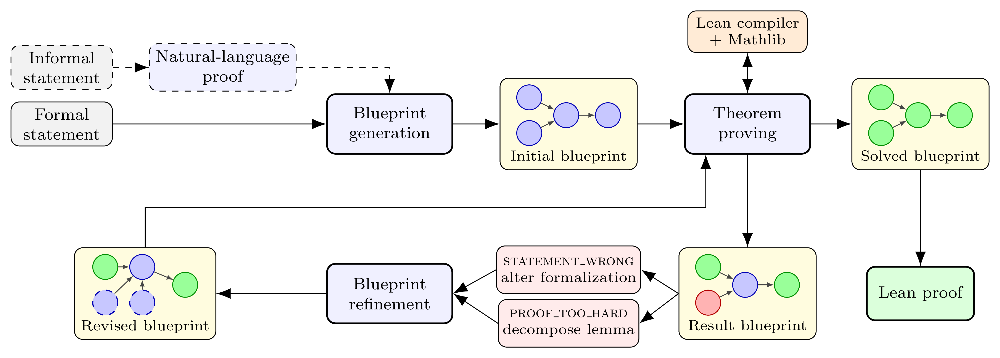

# Goedel-Architect

**Blueprint generation and refinement for formal theorem proving in Lean 4.**
[Paper](https://arxiv.org/abs/2606.06468) · [Project page](https://goedelarchitect.github.io)

Goedel-Architect proves a Lean 4 theorem by first writing a *blueprint*: a
dependency graph of formally stated definitions and lemmas that builds up to
the main theorem. Each lemma is then proved in parallel by a tool-using
prover, and the lemmas that fail drive a refinement of the whole graph.



With the open-weight DeepSeek-V4-Flash as the backbone, it solves 99.2% of
MiniF2F-test and 75.6% of PutnamBench at pass@1. With natural-language proofs
guiding the initial blueprint, it reaches 100% of MiniF2F-test, 88.8% of
PutnamBench (597/672), 4/6 on IMO 2025, 11/12 on Putnam 2025, and 3/6 on
USAMO 2026.

## How it works

| Stage | Paper | Code | Prompt |
|---|---|---|---|
| Natural-language proof guidance (optional) | §3.1 | [`nl_proof.py`](goedel_architect/nl_proof.py) | [`nl_proof_*.md`](goedel_architect/prompts/) |
| Blueprint generation | §3.1 | [`blueprint.py`](goedel_architect/blueprint.py) | [`blueprint_generation.md`](goedel_architect/prompts/blueprint_generation.md) |
| Theorem proving | §3.2 | [`prover.py`](goedel_architect/prover.py) | [`theorem_proving.md`](goedel_architect/prompts/theorem_proving.md) |
| Blueprint refinement | §3.3 | [`refine.py`](goedel_architect/refine.py) | [`blueprint_refinement.md`](goedel_architect/prompts/blueprint_refinement.md) |

**Blueprint generation.** The model turns the formal statement, optionally
guided by a natural-language proof, into one Lean file. Every node is a
[LeanArchitect](https://github.com/hanwenzhu/LeanArchitect) `@[blueprint]`
declaration, and every lemma body is `:= by sorry_using [parents]`, which
records the graph's edges. The model iterates against the Lean compiler until
the file compiles and the graph is valid: acyclic, one main theorem with the
original signature, and every node reachable from it. It also checks that
each lemma's sliced context (its definitions and parents) compiles on its own.

**Theorem proving.** Each lemma gets its own agentic conversation. The prover
sees only the lemma and the declarations it depends on, and uses a
`lean_compile` tool and an optional `mathlib_search` tool. Its proof body is
grafted onto the canonical signature. The proof counts only if it compiles
with no `sorry` and only foundational axioms. If the prover finds a
counterexample, it can instead prove the lemma's negation. If it gives up, it
writes a structured diagnosis: `STATEMENT_WRONG` or `PROOF_TOO_HARD`, with an
analysis and a suggested fix.

**Blueprint refinement.** The blueprint is annotated with each lemma's
verdict and diagnosis. The refinement model rewrites the graph by splitting
hard lemmas, rewiring dependencies, or repairing false statements. Lemmas
that were already proved keep their proofs. The loop alternates proving and
refinement until the main theorem is proved or the iteration budget runs out.

Supporting modules:
- [`graph.py`](goedel_architect/graph.py) parses blueprints, builds each
  lemma's context, grafts and assembles proofs, audits axioms, and prunes dead
  nodes.
- [`lean.py`](goedel_architect/lean.py), [`search.py`](goedel_architect/search.py)
  and [`llm.py`](goedel_architect/llm.py) are the tool and model clients.
- [`pipeline.py`](goedel_architect/pipeline.py) runs the loop.

## Setup

**1. Python** (≥ 3.10):

```bash
pip install -e .
```

**2. A Lean server with Mathlib and LeanArchitect.** The pipeline compiles
through [kimina-lean-server](https://github.com/project-numina/kimina-lean-server).
[`lean/`](lean/) is a small Lean project that provides both libraries. It uses
Lean v4.27.0; to change versions, set `lean-toolchain` and both `rev`s in
`lakefile.toml` to the same release tag.

```bash
cd lean && lake exe cache get && lake build && cd ..   # needs elan; ~7 GB with Mathlib's prebuilt cache

git clone https://github.com/project-numina/kimina-lean-server && cd kimina-lean-server
git clone --depth 1 --branch v4.27.0 https://github.com/leanprover-community/repl && (cd repl && lake build)
pip install -r requirements.txt && pip install . && prisma generate
LEAN_SERVER_PROJECT_DIR=/path/to/goedel-architect/lean LEAN_SERVER_MAX_WAIT=3600 python -m server
```

The server listens on `http://localhost:8000/api/check`; pass another address
with `--lean-server` or `LEAN_SERVER`. `LEAN_SERVER_MAX_REPLS` sets how many
Lean processes run in parallel, and each needs a few GB of memory. The model's
Lean code can run `#eval`, so run the server inside a container or sandbox.

**3. An LLM API key.** The default is DeepSeek-V4-Flash on
[OpenRouter](https://openrouter.ai):

```bash
export OPENROUTER_API_KEY=...
```

Any model on OpenRouter works (`--model`). Other OpenAI-compatible endpoints
also work (`--model-url`, `--api-key-env`).

Mathlib search uses the public [LeanSearch](https://leansearch.net) API. If it
is unreachable, the pipeline turns search off and runs without it. You can
also turn it off yourself with `--search-server none`, or pass the URL of your
own search service. The pipeline sends it `POST {"query": "...", "top_k": 5}`
and expects `{"records": [...]}` back. Each record needs `name_pp` and
`signature`; `kind`, `module_name_pp` and `informal_description` are optional.

## Run

```bash
python -m goedel_architect examples/problems.jsonl --run-dir runs/demo
```

The input is a JSONL file of `{"problem_id", "formal_statement"}` rows. Each
statement ends in `:= by sorry`, and an informal `problem` field is optional.
[`examples/problems.jsonl`](examples/) has nine problems, from a warm-up to
USAMO 2026. For a quick look, try `--limit 3 --refine-iterations 2`.

Useful options (see `--help` for all):

| Option | Default | |
|---|---|---|
| `--model` | `deepseek/deepseek-v4-flash` | backbone for every stage |
| `--refine-iterations` | 7 | refine + re-prove cycles after the first proving pass |
| `--blueprint-samples` / `--refine-samples` | 8 / 8 | attempts until a valid (revised) blueprint |
| `--node-retries` | 4 | attempts per lemma |
| `--nl-proof` | off | first write natural-language proofs and use them to guide the blueprint (`--nl-model` to use a different model) |
| `--nl-proof-from-input` | off | use an `nl_proof` field already in the problems file |
| `--search-server` | leansearch.net | `none` disables Mathlib search; a URL uses your own service |
| `--resume` | | continue a run in `--run-dir` with its saved settings (`run_config.json`) |

Outputs go to `--run-dir`:

```
blueprint/                        generated blueprints (traces.jsonl)
iter00/prove/                     first proving pass
iterNN/refine/, iterNN/prove/     refinement + proving cycles
iterNN/prove/proved_blueprints/   complete Lean proofs (*.lean)
summary.json                      solved problems
```

Each stage directory has `traces.jsonl` (full conversations), `summary.json`
(tokens, cost, solve rates) and `session.log`. Each stage also runs on its own:
`python -m goedel_architect.{nl_proof,blueprint,prover,refine} --help`.

Before trusting a result, re-check every claimed proof. The check compares
the signature verbatim with the official statement, recompiles the file, and
audits the axioms:

```bash
python -m goedel_architect.verify runs/demo --statements examples/problems.jsonl
```

## Citation

```bibtex
@article{chung2026goedelarchitect,
  title   = {Goedel-Architect: Streamlining Formal Theorem Proving with Blueprint Generation and Refinement},
  author  = {Chung, Jui-Hui and Cai, Ziyang and Li, Zihao and Yin, Qishuo and Agarwal, Rohit and Park, Simon and Porto, Rodrigo and Ri, Narutatsu and Yang, Ziran and Tang, Shange and Dang, Xingyu and Lin, Hongzhou and Wang, Mengdi and Chen, Danqi and Jin, Chi and Fowl, Liam H and Arora, Sanjeev},
  journal = {arXiv preprint arXiv:2606.06468},
  year    = {2026}
}
```

## License

Apache-2.0. The example problems come from miniF2F, PutnamBench and USAMO
2026; see [`examples/`](examples/) for their sources.
